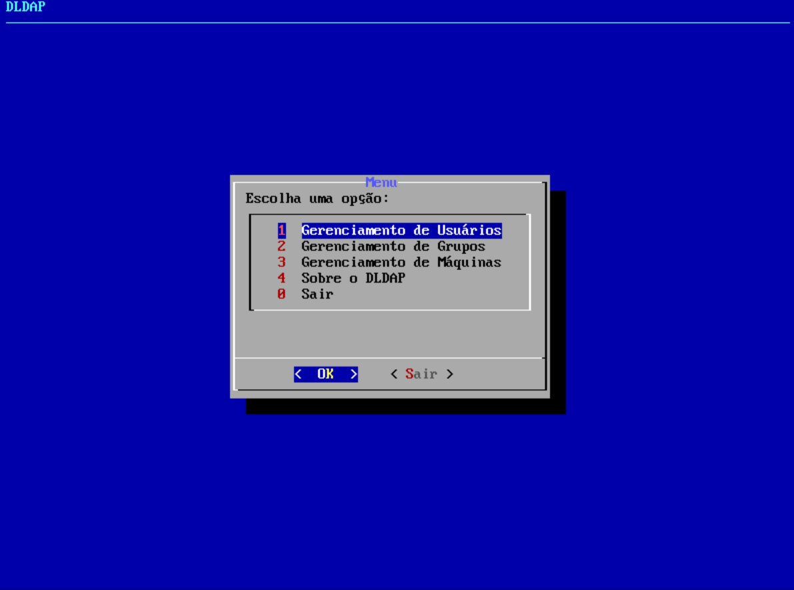

# DLDAP
Gerenciamento de usuários, grupos e máquinas cadastrados em uma base LDAP.

Para saber mais sobre a aplicação, acesse o relatório do projeto mantido na seguinte página: [DLDAP - Relatório](https://josedemelo-if.gitbook.io/dldap/)

